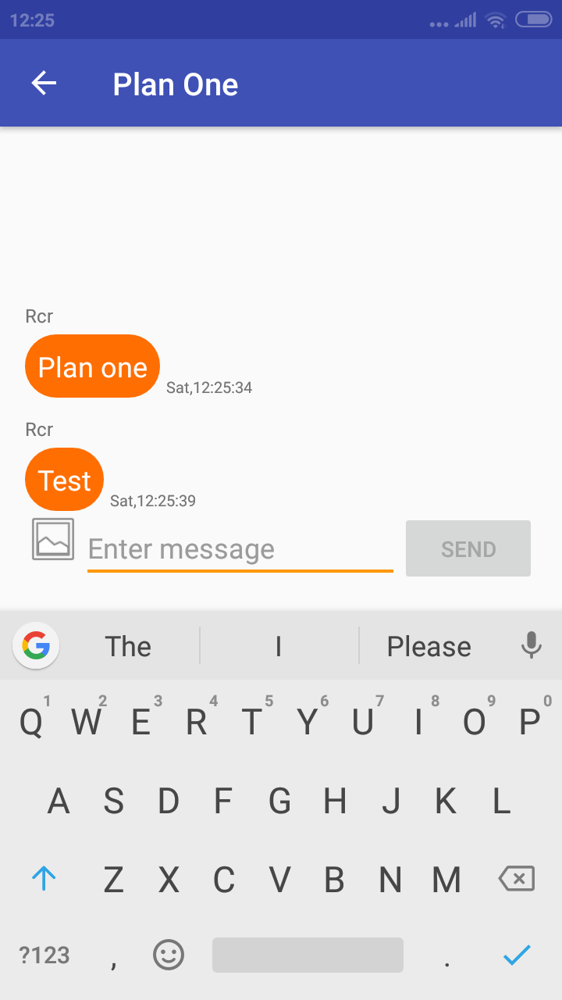

# Android Plan Messaging App
A group messaging app.

## Screenshots
  

## Features
* The messaging takes place in real-time
* Groups can be created for a specific amount of time after which the group will be deleted. Time limit can be set for:
  * For same day
  * Two days
  * Three days
* If the device is offline data is cached locally and automatically synced when the device again regains connectivity.
  
## Technical Details
* Makes use of **Firebase UI** for sign-in users.
* Makes user of **Firebase Phone Authencation** is used for signing up users.
* Makes use of **Firebase Real-time Database** for storing user details and messages.
* Makes use of **[Android-Job library](https://github.com/evernote/android-job)** for handling background tasks.
* Makes use of **[Butter Knife](https://github.com/JakeWharton/butterknife)** for binding views.
